# foundry10 Web Development
## [Development Environment](http://opensail.io)
## [Live Site](http://foundry10.org)

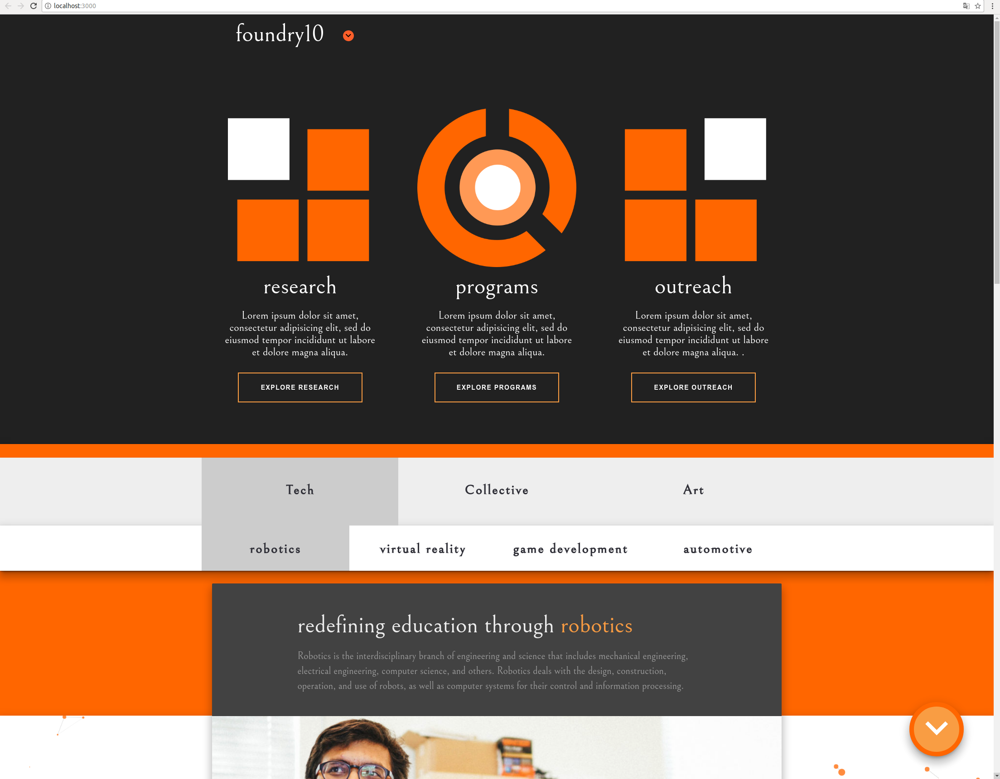

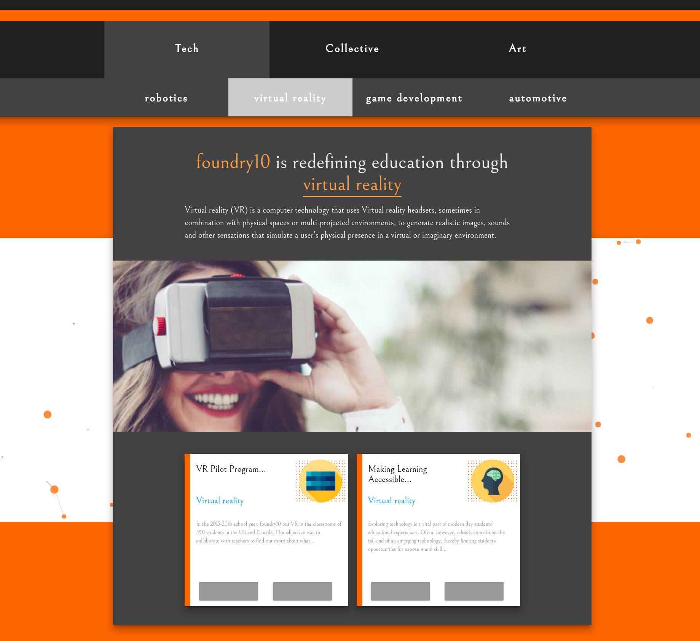

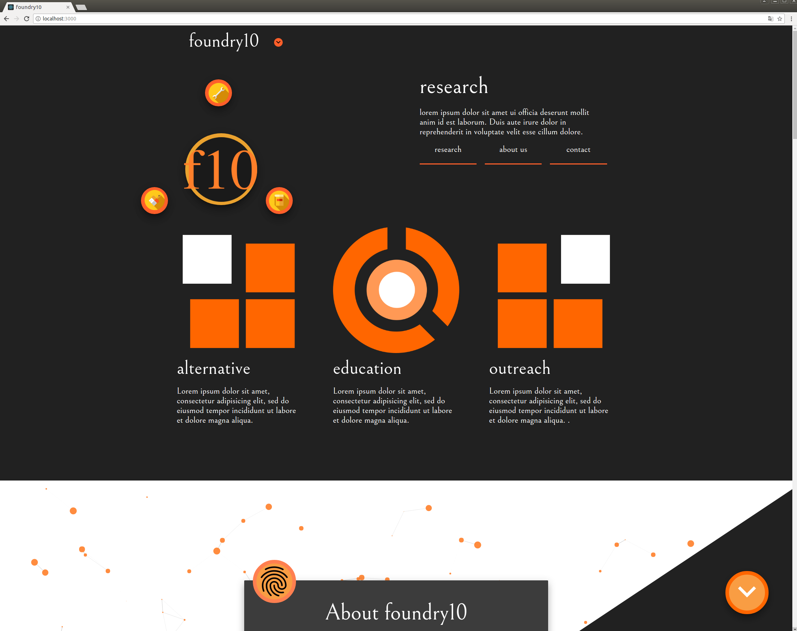

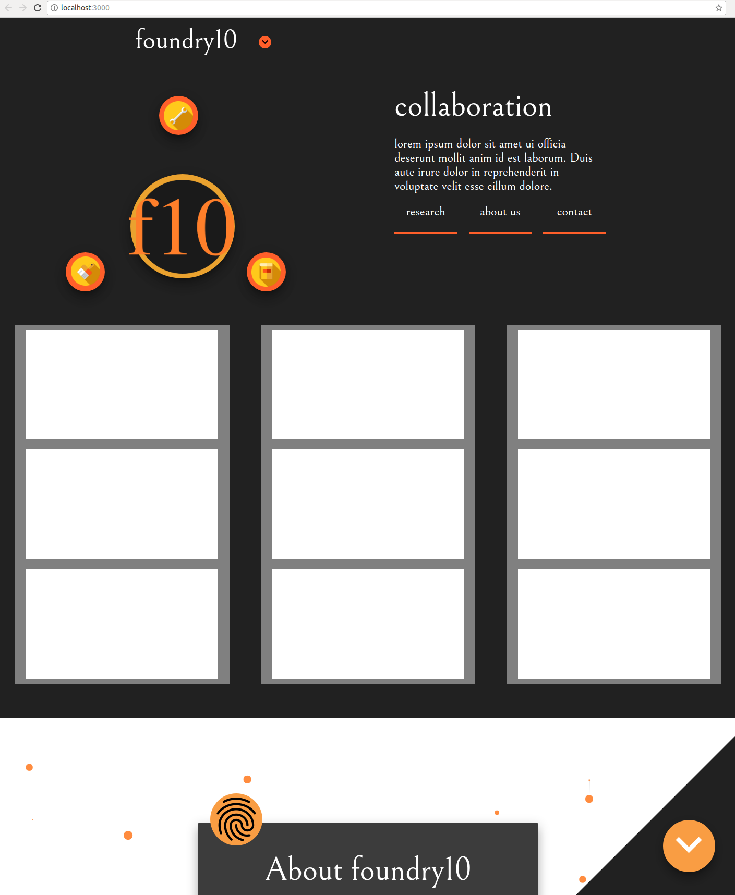

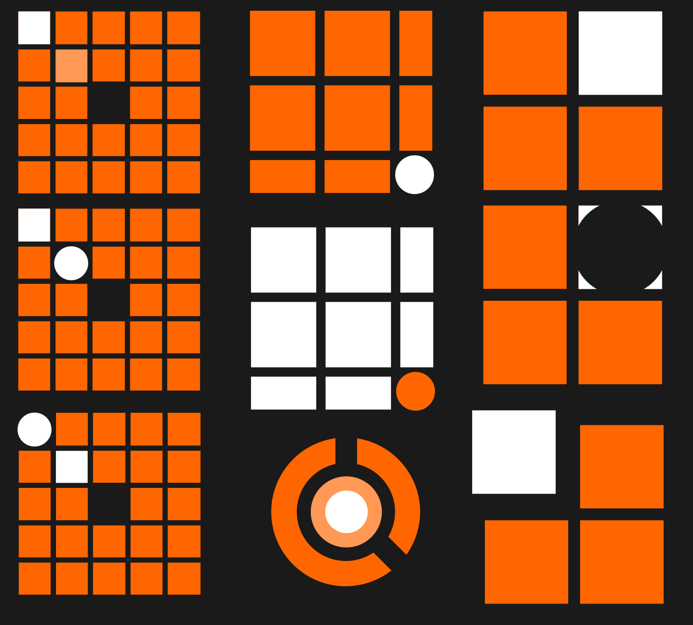

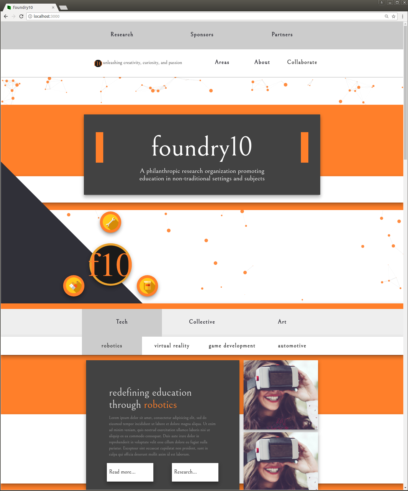

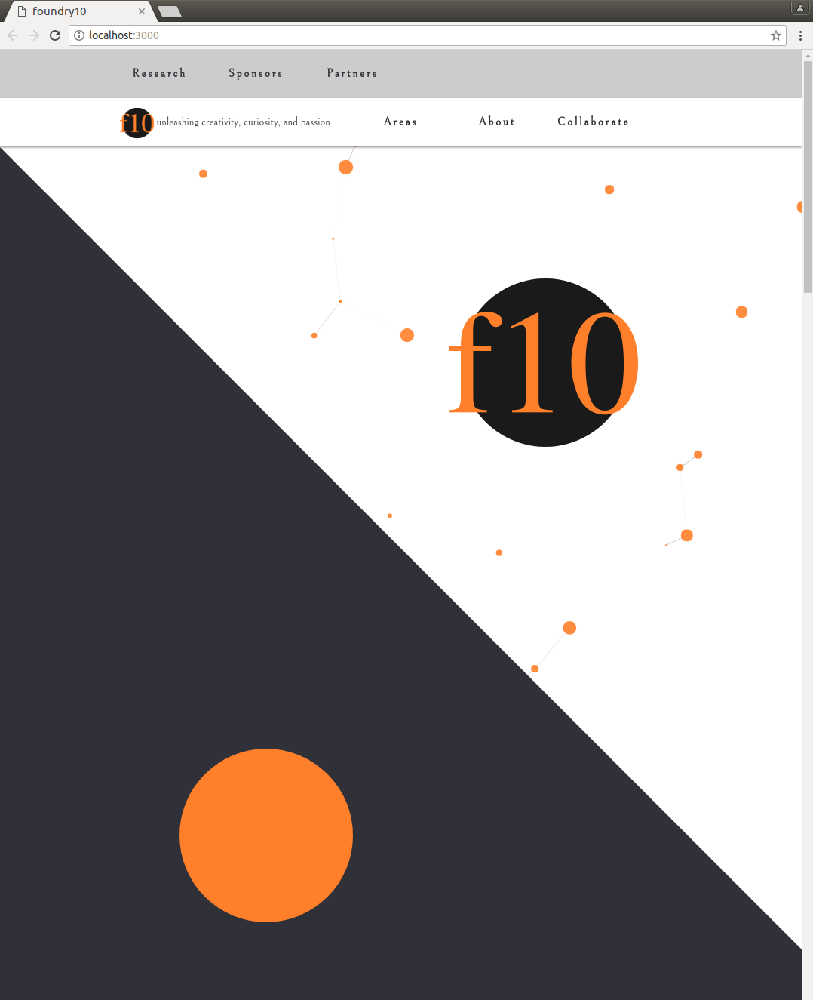

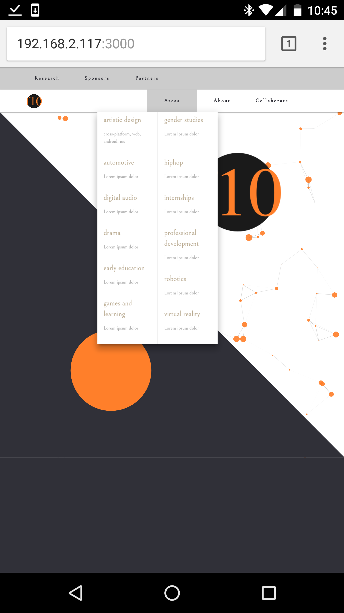


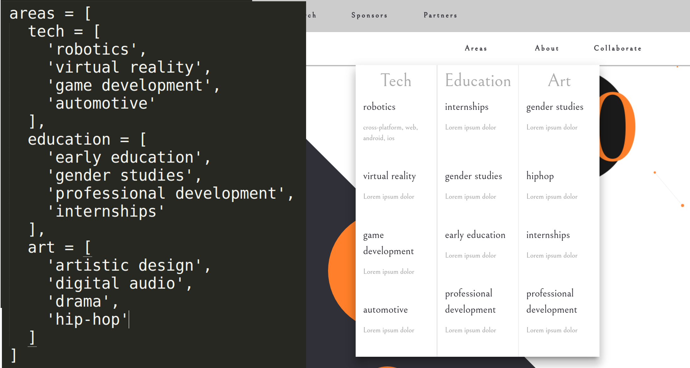

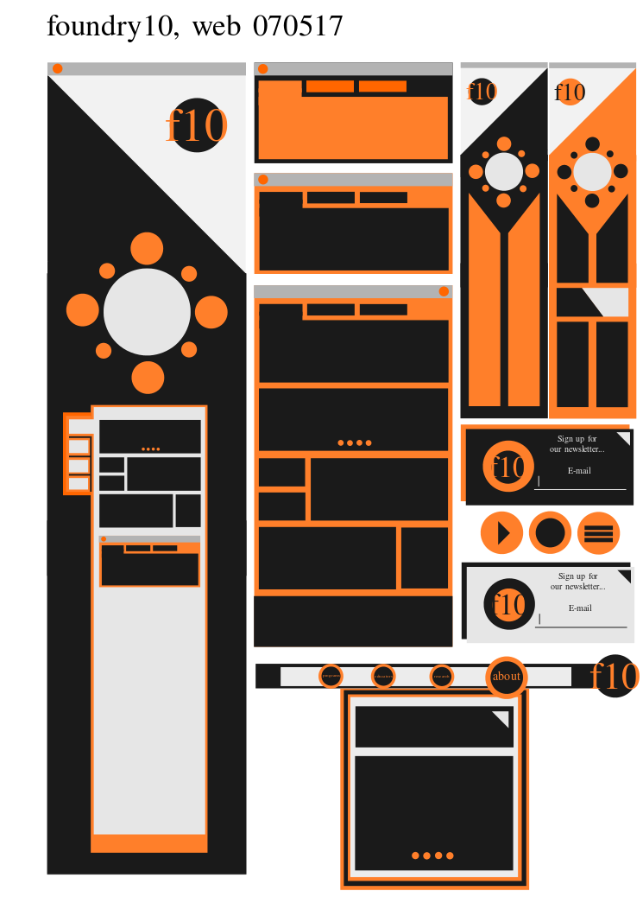

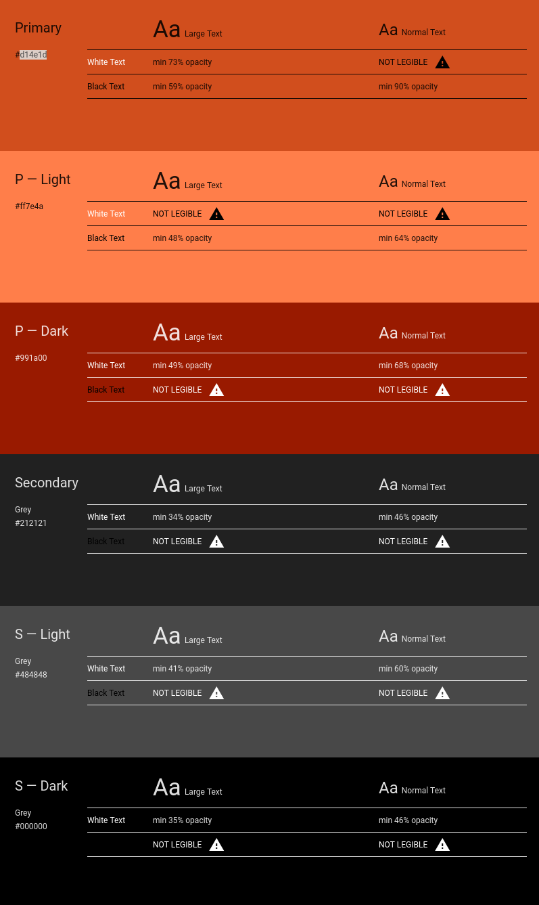
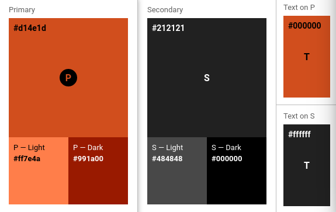


#### Alexander Harris
#### Tuesday July 25th, 2017
#### foundry10 web development intern
#### http://foundry10.org
#### http://opensail.io
#### http://35.167.90.70
#### https://github.com/alexander-io/foundry10-web-development

create data model for articles, replace two link structure in articles with double link, re-work footer to remove areas links

info banner, added more content to articles data model including sub-title, icons and links

merge data models for articles and categories, this allows easy access to the articles that are child elements of each category, also create a truncation function that shortens text based on the number of words and the number of letters -> this is useful for managing overflow of text in the article cards

  note, the truncation function turned out to be an elegeant implementation, so i'll include a function prototype below :

```javascript
let truncate = function(str, num_words) {
  let text_words = str.split(' '), builder = '', i = 0

  // for every wod in the string
  for (word in text_words) {

    // are we at the word limit?
    if (i>=num_words) {
      // check number of characters
      builder = if_lengthy_string_remove_word(builder, num_words*4)
      // concat the ellipses to the string
      builder += '...'
      return builder
    }
    builder += ' ' + text_words[word]
    i++
  }
  return builder
}

// recursively remove extra length from the string until it is within range
let if_lengthy_string_remove_word = function(str, num_chars) {
  let arr = []
  if (str.length > num_chars) {
    arr = str.split(' ')
    arr.pop()
    if_lengthy_string_remove_word(arr.join(' '))
  }
  return str
}

```

fix typo in data model which prevented access of artistic_design articles

for the article cards, fix the size by setting a max/min-height, create an icon_path map which relates (wrench|gears|brick|programmer|controller|display|book|brush) icons with the relative path to the image in the file system

size constraints on articles, truncate sub-title links, bind icons for each click on category

set up initial state of articles so not to include dummy text

modify and capitalize sub-title links

modify banner-header text, now 'foundry10 is redefining education through <insert_category>'

fix the size of the image element in the info banner (now the dimensions are much better and each image is displayed more clearly), for the down arrow controller element, assign scroll targets to infobanner and footer of page, when scroll value is at bottom of page, replace the down arrow icon with an up arrow icon; on click at bottom of page, scroll to top of page

pull functionality of arrow scroll element from the index.html and place it in js/arrow_scroll.js

move animation_loop javascript to self contained file, remove extraneous comments, condense styles

modify hiphop image so that it has more appropriate dimensions for the space that contains it


I spent much time today expanding the data model so to include an array of articles for each category, here's the model :

data model :

```javascript
let tree = {
  // tech branch
  tech : {
    robotics : {
      title : 'robotics',
      innerhtml_nav_text : 'robotics',
      body : 'Robotics is the interdisciplinary branch of engineering and science that includes mechanical engineering, electrical engineering, computer science, and others. Robotics deals with the design, construction, operation, and use of robots, as well as computer systems for their control and information processing.',
      links : [
        'l2',
        'l1'
      ],
      images : [
        'images/info_banner/DSC01400-1-e1472759462425.jpg',
        'http://link1.org'
      ],
      articles : [
        {
          title : 'Elementary After School Lego Club and Robotics Club',
          sub_title : 'Robotics',
          text : 'As part of our work focused on after school programming, we partnered with an elementary school in the greater Seattle area to run a Lego building club for early elementary students (kindergarten and first grade) and a Lego Robotics club for intermediate elementary students (grades 4, 5 and 6). The program ran after school, twice a week for an hour each session, for four weeks. Each was led by classroom teachers with an interest in Legos and each developed their own club curricula and projects. All Lego building kits and robotics kids were donated as part of the after school project with foundry10. We also supplied stipends for the teachers to run the clubs. The goal was to provide opportunities, free of charge, for students to build, explore, and be creative in an after-school setting. Bus transportation was also provided by foundry10 so that there were no transportation barriers for interested students who wanted to attend.',
          icon : icon_path.wrench,
          url_00 : 'http://foundry10.org/areas-overview/robotics/',
          url_01 : 'http://foundry10.org/wp-content/uploads/2017/06/Elementary-Lego-and-Robotics.pdf'
        } , {
          title : 'Robotics Brief',
          sub_title : 'Fall 2016',
          text : 'Throughout the fall of the 2016-2017 school year, foundry10 ran robotics programs in two schools around Seattle: The Nova Project and Seattle Girl’s School. We were interested in how exposure to our student-led robotics program improved student confidence with technology, productive risk-taking, and the perception of robotics as a community exercise. We used a combination of likert-type scale survey questions and open-ended questions. We found some gains in these areas, but hope to expand our sample size to improve our understanding of the impact that this experience has on students.',
          icon : icon_path.gears,
          url_00 : 'http://foundry10.org/areas-overview/robotics/',
          url_01  : 'http://foundry10.org/wp-content/uploads/2017/06/Robotics-Fall-2016-brief.pdf'
        }
      ]
    },
    vr : {
      title : 'virtual reality',
      innerhtml_nav_text : '<span class="hide-on-med-and-down truncate">virtual reality</span><span class="hide-on-large-only">vr</span>',
      body : 'Virtual reality (VR) is a computer technology that uses Virtual reality headsets, sometimes in combination with physical spaces or multi-projected environments, to generate realistic images, sounds and other sensations that simulate a user\'s physical presence in a virtual or imaginary environment.',
      links : [
        'http://link1.org',
        'http://link1.org'
      ],
      images : [
        'images/info_banner/ao-vr-crop.png',
        'images/info_banner/vr-student.jpg'
      ],
      articles : [
        {
          title : 'VR Pilot Program Initial Findings',
          sub_title : 'Virtual reality',
          text : 'In the 2015-2016 school year, foundry10 put VR in the classrooms of 390 students in the US and Canada. Our objective was to collaborate with teachers to find out more about what really happens when VR enters the classroom. Through a series of surveys and interviews, we gathered data at the beginning, middle and end of the program in each school. The teachers used the technology in the way that made sense for them and their students, and as a result we were granted a view at a wide variety of different ideas for how VR can enhance classroom learning. Below are our initial reports,the dataset that includes the anonymized survey responses from the students in the program, and a brief description of the program itself. Please take a look and reach out to us if you have any thoughts or questions.',
          icon : icon_path.brick,
          url_00  : 'http://foundry10.org/areas-overview/virtual-reality/',
          url_01  : 'http://foundry10.org/research/vr-pilot-program-initial-findings/'
        } ,  {
          title : 'Making Learning Accessible in New Ways',
          sub_title : 'Virtual reality',
          text : 'Exploring technology is a vital part of modern day students’ educational experiences. Often, however, schools come in on the tail-end of an emerging technology, thereby limiting students’ opportunities for exposure and skill development. Advanced technology can be considered a type of cultural capital which students can utilize in order to progress and navigate future career pathways. Virtual reality is one such advanced technology, now readily commercially available, which is making its way into classrooms. Our recent research focusing on the implementation of VR in classrooms provides information about how educators can make VR accessible to students. Access in virtually reality can be considered through multiple lenses and we discuss a few of them here. The first considers learning styles and nontraditional engagement, the second discusses access to a global education, and the third revolves around issues of social justice. We feel these areas are highly relevant considerations for educators as they consider the use of virtual reality.',
          icon : icon_path.programmer,
          url_00  : 'http://foundry10.org/research_category/virtual-reality/',
          url_01  : 'http://foundry10.org/research/virtual-reality-making-learning-accessible-in-new-ways/'
        }
      ]
    },
    game_dev : {
      title : 'game development',
      innerhtml_nav_text : '<span class="hide-on-med-and-down truncate">game development</span><span class="hide-on-large-only truncate">game dev. </span>',
      body : 'Video game development is the process of creating a video game. Development is undertaken by a game developer, which may range from one person to a large business. Traditional commercial PC and console games are normally funded by a publisher and take several years to develop.',
      links : [
        'http://link1.org',
        'http://link1.org'
      ],
      images : [
        'images/info_banner/games-and-learning.jpg',
        'image_path_1'
      ],
      articles : [
        {
          title : 'Beyond Programming – The Power of Making Games',
          sub_title : 'Game Development',
          text : 'Art and creative expression have an interesting way of weaving in and out of classrooms, offering students the opportunity to explore their own ideas and minds. Video games are no different, and while most of the discussion about their use in classrooms centers on play, we at foundry10 wanted to examine the value of making games. Through easily accessible programs such as Scratch and Gamemaker, students from early elementary up through college are creating games and learning while doing it. We gathered surveys from 107 game design and development professionals and 300 middle school students, before and after a game development class, about the value of teaching game development in a middle school class. Then we compared the responses of the 7th- and 8th-graders with what the game developers said they felt would be important about making games. We hope this information will help teachers who are constructing game development classes, and show the broader view of the value inherent in game development that professional game makers can provide.',
          icon : icon_path.programmer,
          url_00  : 'http://foundry10.org/areas-overview/games-and-learning/',
          url_01  : 'http://foundry10.org/research/beyond-programming-the-power-of-making-games/'
        } , {
          title : 'Number processing ability and logitunal MOBA skill',
          sub_title : 'Games and Learning',
          text : 'The popularity of multiplayer online battle arena (MOBA) games provides an opportunity to examine how cognitive skills are linked with changes in player performance within a team-based game genre. There is evidence that video game experience in other genres is connected with specific cognitive skills such as visuospatial attention and working memory capacity. Links have also been observed outside of video games such as numerical intelligence being correlated with the performance of chess experts. In the present study, we investigated whether numerical and working memory ability measured at an initial time-point predicted changes in MOBA skill and gameplay frequency measured five months later.',
          icon : icon_path.controller,
          url_00  : 'http://foundry10.org/areas-overview/games-and-learning/',
          url_01  : 'http://foundry10.org/research/number-processing-ability-and-logitunal-moba-skill/'
        }
      ]
    },
    automotive : {
      title : 'automotive',
      innerhtml_nav_text : '<span class="hide-on-med-and-down truncate">automotive</span><span class="hide-on-large-only truncate">auto</span>',
      body : 'The automotive industry is a wide range of companies and organizations involved in the design, development, manufacturing, marketing, and selling of motor vehicles, some of them are called automakers. It is one of the world\'s most important economic sectors by revenue.',
      links : [
        'http://link1.org',
        'http://link1.org'
      ],
      images : [
        'images/info_banner/auto-tech-ov-blog-768x403.png',
        'images/info_banner/'
      ],
      articles : [
        {
          title : 'Learning from the Pros',
          sub_title : 'Lessons from Long Beach',
          text : 'When we brought students to Long Beach to see Formula Drift, one of the most impactful parts of the experience was getting to meet real working professionals in the automotive industry. While integrating professionals has been a key part of many of our programs, automotive technology gets particular benefits from this as the industry is so broad and the pathways into it are not always clear. We wrote the below report to showcase what the students and teachers, in their own words, got from meeting with the pros.',
          icon : icon_path.gears,
          url_00  : 'http://foundry10.org/areas-overview/automotive/',
          url_01  : 'http://foundry10.org/wp-content/uploads/2017/06/Learning-from-the-Pros.pdf'
        } , {
          title : 'Automotive Technology Research',
          sub_title : 'Automotive Research',
          text : 'Throughout our work with automotive technology, we have been studying how the students respond to the subject, and seek to answer our three critical questions for the program. The report below breaks down how we look at auto-tech, what is exciting to us in terms of learning, and some of the data that we have gathered on the subject so far.',
          icon : icon_path.wrench,
          url_00  : 'http://foundry10.org/areas-overview/automotive/',
          url_01  : 'http://foundry10.org/wp-content/uploads/2016/07/AutomotiveTechnologyResearch.pdf'
        }
      ]
    }
  },
  // collective branch
  collective : {
    intern : {
      title : 'internships',
      innerhtml_nav_text : '<span class="hide-on-med-and-down truncate">internships</span><span class="hide-on-large-only truncate">intern</span>',
      body : 'Internships for professional careers are similar in some ways but not as rigorous as apprenticeships for professions, but the lack of standardisation and oversight leaves the term open to broad interpretation. Interns may be college or university students, high school students, or post-graduate adults.',
      links : [
        'http://link1.org',
        'http://link1.org'
      ],
      images : [
        'images/info_banner/foundry10-internships-thumb.png',
        'image_path_1'
      ],
      articles : [
        {
          title : 'Student-Led Internships',
          sub_title : 'An Exploration of Interest, Motivation, and Process',
          text : 'Through partnerships with schools that follow the Big Picture Model of learning (which includes internship experiences within the local community), afterschool programs and summer programs, we have developed what we call the “Student-Led Internship”. The design of this program, involving high school aged students, is developmentally appropriate, cognitively challenging and a more unstructured environment through which collaboration, creativity, entrepreneurial thinking, design thinking and constructivist learning emerge. In this environment intellectual risk-taking is not only encouraged, it is a necessary component for success. What is not necessary is having a project that works “right” or even looks like the idea that the students walked in the door with. The learning is in the process, not the product.',
          icon : icon_path.brick,
          url_00  : 'http://foundry10.org/areas-overview/internships/',
          url_01  : 'http://foundry10.org/wp-content/uploads/2016/08/Student-Led-Internships.pdf'
        } , {
          title : 'Summer 2016 Internship Findings',
          sub_title : 'Internship Research Findings',
          text : 'This slideshow includes the findings from our internship program in the summer of 2016. The interns worked across a variety of subject areas from virtual reality to fashion to drone building. These findings are from the interview series that we conduct as a part of the program. Take a look at the report below for details!',
          icon : icon_path.display,
          url_00  : 'http://foundry10.org/areas-overview/internships/',
          url_01  : 'http://foundry10.org/wp-content/uploads/2016/10/Summer-Internships-2016-Summary-of-Findings.pdf'
        }
      ]
    },
    gender : {
      title : 'gender studies',
      innerhtml_nav_text : '<span class="hide-on-med-and-down truncate">gender studies</span><span class="hide-on-large-only truncate">gender</span>',
      body : 'Gender studies is a field for interdisciplinary study devoted to gender identity and gendered representation as central categories of analysis. This field includes women\'s studies (concerning women, feminism, gender, and politics), men\'s studies and queer studies.',
      links : [
        'http://link1.org',
        'http://link1.org'
      ],
      images : [
        'images/info_banner/foundry10-girls-program-thumb.png',
        'image_path_1'
      ],
      articles : [
        {
          title : 'Imagination, gender and their importance in perceived choices',
          sub_title : 'Gender Studies',
          text : 'One of the very first programs we ran was focused on a group of 5 female teens and their drive to try new things. Along with foundry10, the girls tried out a number of new and unusual activities ranging from skateboarding to blacksmithing to paintball. We talked to the girls about the experiences and how trying new things affected their view on the world and the choices available to them. In the summer of 2014, we shared this information with the Imaginative Education Research Group. You can find our slides with our findings below.',
          icon : icon_path.wrench,
          url_00  : 'http://foundry10.org/areas-overview/girls-programs/',
          url_01  : 'http://foundry10.org/research/dota-2-exploratory-interviews/'
        } , {
          title : 'Shakespeare for Girls',
          sub_title : 'Gender Video',
          text : 'This is a video demonstrating a gender studies drama related program : Shakespeare for girls.',
          icon : icon_path.book,
          url_00  : 'https://youtu.be/KvRvEp6IEWg',
          url_01  : 'http://foundry10.org/areas-overview/girls-programs/'
        }
      ]
    },
    early_education : {
      title : 'early education',
      innerhtml_nav_text : '<span class="hide-on-med-and-down truncate">early education</span><span class="hide-on-large-only truncate">early ed.</span>',
      body : 'Early childhood education is a branch of education theory which relates to the teaching of young children (formally and informally) up until the age of about eight. Infant/toddler education, a subset of early childhood education, denotes the education of children from birth to age two.',
      links : [
        'http://link1.org',
        'http://link1.org'
      ],
      images : [
        'images/info_banner/side-by-side-oculus.jpg',
        'image_path_1'
      ],
      articles : [
        {
          title : 'Augmented Math/Reading Intervention',
          sub_title : 'Elementary Education',
          text : 'Foundry10 and an elementary school in the greater Seattle area teamed up together to augment the district funded math and reading spring after school intervention program. We were interested in providing additional funding so that 5th and 6th graders could receive support in the target subject areas, with smaller class sizes, under the guidance of certified classroom teachers. The intervention program ran for 7 sessions concurrently with the district funded program for grades K-4. The goal was to see improvements in both students’ academic performance in the targeted subject areas as well as in their attitudes towards the subject areas.',
          icon : icon_path.book,
          url_00  : 'http://foundry10.org/areas-overview/early-education/',
          url_01  : 'http://foundry10.org/wp-content/uploads/2017/06/AugmentedMathReadingAnonymized.pdf'
        } , {
          title : 'Shoreline Kindergarten Readiness Program Report',
          sub_title : 'Early Education Report',
          text : 'In Summer 2016, foundry10 collaborated with Shoreline School District to support a month-long kindergarten readiness program. Students coming in to kindergarten have a wide range of skill sets, with some students more prepared for the demands of kindergarten than others. To close the readiness gap, Shoreline approached us with the idea to design a summer class with the express purpose of preparing students for their first year in kindergarten. We decided to focus on boosting skills at this age, because of evidence that early intervention is particularly beneficial in closing achievement gaps. Elementary schools throughout the district identified students who were enrolled in kindergarten but hadn’t previously had preschool, and invited a small number of these students to participate. One class of seven students participated in July before starting kindergarten the following month.',
          icon : icon_path.brick,
          url_00  : 'http://foundry10.org/areas-overview/early-education/',
          url_01  : 'http://foundry10.org/research/shoreline-kindergarten-readiness/'
        }
      ]
    },
    professional_development : {
      title : 'professional development',
      innerhtml_nav_text : '<span class="hide-on-med-and-down truncate">professional dev.</span><span class="hide-on-large-only truncate">pro. dev.</span>',
      body : 'Professional development is learning to earn or maintain professional credentials such as academic degrees to formal coursework, conferences and informal learning opportunities situated in practice. It has been described as intensive and collaborative, ideally incorporating an evaluative stage.',
      links : [
        'http://link1.org',
        'http://link1.org'
      ],
      images : [
        'images/info_banner/lydia-2.jpg',
        'image_path_1'
      ],
      articles : [
        {
          title : 'Parkwood Intervention Program',
          sub_title : 'Elementary School Alternative Ed.',
          text : 'The Shoreline Schools Foundation and foundry10 partnered to create an original program at Parkwood Elementary, during spring break 2016. We joined creative/dramatic arts with traditional CORE curriculum for 5-days over Spring Break. Students testing at the cusp of being able to pass the SBAC in April were invited to the week-long intervention. In this program, dedicated teachers were paired with passionate teaching artists for ten full hours of preparation in the months leading up to the week-long experience. We found that providing this amount of time for creating imaginative curriculum between two different talented and capable educators would provide the unique context for a week-long break camp where traditional classroom curriculum could be experienced in an artful way.',
          icon : icon_path.brick,
          url_00  : 'http://foundry10.org/areas-overview/professional-development/',
          url_01  : 'http://foundry10.org/research/parkwood-intervention-program-2/'
        } , {
          title : 'TAT LAB : Wonderwalls and Sharing Circles',
          sub_title : 'Professional Development',
          text : '“If there’s something you’re still wondering about, write it on this post it note and stick it to the wonder-wall and then come join me in a circle!” With over twenty hands in the air, the energy in the room at the Teaching Artist Training Lab, hosted by Seattle Children’s Theater, is palpable. The teachers just want to keep the discussion going and would do so well into the night. The wonder-wall serves as a great way to table topics for later discussion during lunch breaks, walks, and even drives home.',
          icon : icon_path.book,
          url_00  : 'http://foundry10.org/areas-overview/professional-development/',
          url_01  : 'http://foundry10.org/subject-areas/tat-lab-professional-development-teaching-artists/'
        }
      ]
    }
  },
  art : {
    artistic : {
      title : 'artistic design',
      innerhtml_nav_text : '<span class="hide-on-med-and-down truncate">artistic design</span><span class="hide-on-large-only truncate">design</span>',
      body : 'Design is the creation of a convention for the construction of an object, system or measurable human interaction. Design has different connotations in most fields. In some cases, the direct construction of an object. Pottery, engineering, coding, and graphic design are also considered to use design thinking.',
      links : [
        'http://link1.org',
        'http://link1.org'
      ],
      images : [
        'images/info_banner/creativity-intern-3-768x263.jpg',
        'image_path_1'
      ],
      articles : [
        {
          title : 'Y-We Camp Report',
          sub_title : 'Artistic Design Report',
          text : 'In this report, we dig into a fashion camp that we ran with Young Women Empowered. Please take at the document below to find out more about the camp and what we learned.',
          icon : icon_path.brush,
          url_00  : 'http://foundry10.org/areas-overview/artistic-design/',
          url_01  : 'http://foundry10.org/research/y-we-camp-report/'
        } , {
          title : 'Y-We Create Fashion Show ',
          sub_title : 'Fashoion Show Video',
          text : 'The Y-We fashin show was documented for your viewing pleasure',
          icon : icon_path.brick,
          url_00  : 'https://youtu.be/p6sw-tvxl_4',
          url_01  : 'http://foundry10.org/areas-overview/artistic-design/'
        }
      ]
    },
    digital_audio : {
      title : 'digital audio',
      innerhtml_nav_text : '<span class="hide-on-med-and-down truncate">digital audio</span><span class="hide-on-large-only truncate">audio.</span>',
      body : 'Digital audio is a technology that can be used to record, generate, manipulate, and reproduce sound using audio signals that have been encoded in digital form. Following significant advances in digital audio technology during the 1970s, it gradually replaced analog audio technology in many areas of sound production.',
      links : [
        'http://link1.org',
        'http://link1.org'
      ],
      images : [
        'images/info_banner/audio-report-blog.png',
        'image_path_1'
      ],
      articles : [
        {
          title : 'Digital Audio Report',
          sub_title : 'Audio, 2014 - 2016',
          text : 'This report covers what we have learned over the past 3 years running digital audio programs in schools, with community partners, and on our own.We have been running digital audio programs since 2014, and have explored many different ways of offering and structuring the courses. While there is still so much to learn about the subject, the audio team at foundry10 has put together a report showcasing the work they have done and what they have learned about how high school students interact with digital audio. Please read the report below if you want to find out more about our audio program, its history, and what we have learned so far.',
          icon : icon_path.brush,
          url_00  : 'http://foundry10.org/areas-overview/digital-audio/',
          url_01  : 'http://foundry10.org/research/digital-audio-report-2014-2016/'
        } , {
          title : 'Audio Workshops',
          sub_title : 'Digital Audio',
          text : 'A big part of learning to work with digital audio is expanding specific skillsets and learning fun new ways to create and manipulate sound. To supplement the program, we bring in exciting and fun events to showcase different functions and teach youth and adults alike.',
          icon : icon_path.brush,
          url_00  : 'http://foundry10.org/areas-overview/digital-audio/',
          url_01  : 'http://foundry10.org/subject-areas/audio-workshop-events/'
        }
      ]
    },
    drama : {
      title : 'drama',
      innerhtml_nav_text : '<span class="hide-on-med-and-down truncate">drama</span><span class="hide-on-large-only truncate">drama</span>',
      body : 'Drama is the specific mode of fiction represented in performance.[1] Considered as a genre of poetry in general, the dramatic mode has been contrasted with the epic and the lyrical modes ever since Aristotle\'s Poetics (c. 335 BCE)—the earliest work of dramatic theory.',
      links : [
        'http://link1.org',
        'http://link1.org'
      ],
      images : [
        'images/info_banner/dramatic-arts-blog-768x403.png',
        'image_path_1'
      ],
      articles : [
        {
          title : 'Dramatic Storytelling and Literacy',
          sub_title : 'Drama',
          text : 'This article describes a method of exploring and expanding literacy using dramatic storytelling techniques. In this program, we paired drama teaching artists with teachers to engage young students in literacy-based exercises in a unique and fun way. You can download the report here: Dramatic Storytelling and Literacy',
          icon : icon_path.programmer,
          url_00  : 'http://foundry10.org/areas-overview/drama/',
          url_01  : 'http://foundry10.org/research/dramatic-storytelling-literacy/'
        } , {
          title : 'Shoreline Reading Intervention at Briarcrest Elementary',
          sub_title : 'Early Ed. Theater',
          text : 'In the summer of 2016, foundry10 partnered with Shoreline Schools Foundation to bring a fuller iteration of the dramatic arts infused intervention program for summer school attendees. With four teaching artists who collaborated with one another on creating curriculum that infused literature and dramatic arts, they served ten different classes, grades K-3 and ELL, with a theater arts intervention.',
          icon : icon_path.brick,
          url_00  : 'http://foundry10.org/areas-overview/drama/',
          url_01  : 'http://foundry10.org/research/shoreline-reading-intervention-briarcrest-elementary/'
        }
      ]
    },
    hiphop : {
      title : 'hip-hop',
      innerhtml_nav_text : '<span class="hide-on-med-and-down truncate">hip hop</span><span class="hide-on-large-only truncate">hip hop</span>',
      body : 'Hip hop is a subculture and art movement developed by African Americans[1] from the South Bronx in New York City during the late 1970s.[2][3][4][5][6] While people unfamiliar with hip hop culture often use the expression "hip hop" to refer exclusively to hip hop music (also called "rap")',
      links : [
        'http://link1.org',
        'http://link1.org'
      ],
      images : [
        'images/info_banner/hip-hop-dance-2.png',
        'image_path_1'
      ],
      articles : [
        {
          title : 'Parkwood Math and Reading Intervention',
          sub_title : 'Creative/Dramatic Art',
          text : 'During the spring of 2016, foundry10 teamed up with Shoreline School District to provide a week-long math and reading program that had an integrated drama component with the goal of enhancing student skills and motivation. Shoreline Schools Foundation and foundry10 partnered to create an original program at Parkwood Elementary School Spring Break 2016 where we joined creative/dramatic arts with traditional CORE curriculum for 5-days over Spring Break. Students testing at the cusp of being able to pass the SBAC in April were invited to the week-long intervention. Four teachers were recruited for the program that targeted 3rd through 6th grade students. From April 18-22, foundry10 instructors provided classroom instruction, including 20 hours of integrated and direct instruction with drama to explore the content and structure of stories.',
          icon : icon_path.programmer,
          url_00  : 'http://foundry10.org/research/parkwood-math-and-reading-intervention-spring-2016/',
          url_01  : 'http://foundry10.org/areas-overview/hip-hop/'
        } , {
          title : 'The Importance of Frustration in Dance',
          sub_title : 'Hip Hop Dance',
          text : 'Working with dance students, we frequently encounter performance anxiety and frustration. However, we believe that encountering and overcoming these difficult feelings is one of the biggest challenges through which Hip Hop, and dance in general, creates value for students of all skill levels. Now, after nearly three years of dance programs, the team at foundry10 has put together a retrospective and qualitative view on how frustration and dance mix together to create confidence, discipline, and resilience in dancers.',
          icon : icon_path.gears,
          url_00  : 'http://foundry10.org/areas-overview/hip-hop/',
          url_01  : 'http://foundry10.org/research/the-importance-of-frustration-in-dance-2/'
        }
      ]
    }
  }
}

```


#### Tuesday July 11th, 2017

Today I'm setting out to primarily work toward two goals. First, make the expose page mobile friendly and friendly to screens that have non-standard aspect ratios. Next, program the info-banner display functionality.

On the mobile/aspect-ratio front, I've identified and fixed a HUGE issue in the code. Each of the elements in the DOM were having their y-axis values (offset from top of screen) set accordign ot percentages of the available screen area. This caused undesirable overlap of elements when viewed on non-standard aspect ratio monitors. The issue was twofold, first I centreed an absolutely positioned element in a wonky way by manipulating the left-offset of a parent and the negative-left-offset of the child. This created 'overflow' to occur on mobile viewing.

In modifying the navigation bar, I unintentionally made a modification that killed the UI for mobile viewing. For each revealed drop-down menu, it was positioned in the window far to the left so that it was only partially viewable. I was able to fix this with some math. Here's how I did it...

  let's assume that we have some number of navigation-bar buttons and dropdown menus to place beneath them in the DOM.

  calling the getBoundingClientRect() function on the nav-bar button will return (x,y) coordinate positions of the nav-bar button in the DOM, especially the distance from the left (origin) of the window to the left and right side of the nav-button element, and the width of the element.

  assume 'n' is the nav-bar button element
    n.left is the pixel distance from the left/origin of the screen to the left side of the element
    n.right is the pixel distance from the left/origin of the screen to the right side of the element
    n.width is the pixel distance from the left side to the right side of the element

  assume 'd' is the drop-down menu
    similar to the nav-bar element, the dropdown menu has similar properties : d.left, d.right, and d.width

  find the center of the nav-bar element
    let nav_bar_elem_center_point = n.left + (n.right - n.left)

  position the dropdown menu left side first at the center point of the nav-item element, then subtract half of the width of the drop-down menu from the left/origin offset
    d.left = nav_bar_elem_center_point - (d.width/2)

  voila, this scheme will align the center of the dropdown menu with the center point of the corresponding nav-bar element. note, the above scheme works well for full-screen layouts. however, for mobile there's not enough screen width to use this scheme; if used, drop-down menus may be positioned partially offscreen. therefore, I've programmed another scheme to handle the mobile screen case... find the mobile drop-down menu scheme below...

  this case is actually easier! instead of aligning the dropdown menus with their corresponding nav-bar elements, simply align all of the dropdown menus with the screen center.

  assuming the same environment above with 'n' and 'd', also assume that we have access to the width of the screen with : window.innerWidth

  find the center of the screen
    let screen_center = (window.innerWidth/2)

  similar to the above, first align the left side of the dropdown menu with the center of the screen then subtract half the width of the dropdown menu in pixels from the offset of the dropdown
    d.left = screen_center - (d.width/2)

  voila, this will position the dropdown menu in alignment with the screen center

I've added a number of functional elements to the info-banner. Now, the info-banner 'module' has core functionality. For each click on a super-category, change the text values of the sub-category links so that they correspond to the super-category; tech => [robotics, vr, game_dev, auto]. For each click on a sub-category, update the display windows with the header and text-body content corresponding to that category.

Last major update for the day, I've included a number of images in the project repository from the f10 site. For some of these images, I've associated them with sub-categories and they're populated to the display in the info_banner on category clicks.


#### Monday July 10th, 2017
#### foundry10 web development intern
#### http://foundry10.org
#### http://opensail.io
#### http://35.167.90.70
#### https://github.com/alexander-io/foundry10-web-development

Good morning! I've arrived at 8:25 am to the office this morning & Anna was punctual/kind enough to let me in.

Today I'm setting out to accomplish the following goals.
    1. make the accordian post
    2. clean and document html, css, and javascript (the code is getting unwieldy in some places)
    3. minify the javascript used on the web page to optimize the user experience and reduce latency
    4. modify the circle/triangular graphic to position it better on the landing page (I want to see desirable locations for the element on full, tablet, and mobile sizes)
    5. make sketches of tom's white-board notes for the wev-development modules
    6. enlarge the text on the nav-bar, increase the height of the nav-bar (it's impossible small, especially on mobile)
    7. meet with Andrun & the web-security group to offer direction and measure progress

let done = true
let undone = false

goals_checklist = {
    accordian_post : done,
    clean_document : ish,
    minify_js : undone,
    position_graphic : done,
    sketch_toms_notes : undone,
    group_meetings : done
}


#### Friday July 7th, 2017
#### foundry10 web development intern
#### http://foundry10.org
#### http://opensail.io
#### http://35.167.90.70
#### https://github.com/alexander-io/foundry10-web-development

This morning I met with Lisa and Anna regarding a naming convention used in the navigation bar. They suggested replacing the 'education' category by titling it 'collective' instead.

Today I rehashed my high-school geometry skills (or lack-there-of) in order to mathematically define an equilateral triangle animation for the expose page. I want to define three points in the web page, one for each point of the triangle. These points must have a common center point and be equidistant from each other. The center point and the radius of the triangle are given. Solve for all three points in the triangle : p1, p2, and p3.

Given :

  const center_point = {x:0, y:0}
  const triangle_radius = 100

Determining the x,y coordinates of point 1 is simple, just assume it's directly above the center point, so... add the triangle's radius to p1.y and leave p1.x at center_point.x

  let p1 = p2 = p3 = {x:null,y:null}

  p1 = {
    x : center_point.x,
    y : center_point.y + triangle_radius
  }

  checklist...
    [x] p1
    [ ] p2
    [ ] p3

Given a radius, determine the side-length of the triangle with the following :

  let side_len = triangle_radius * (Math.sqrt(3))

Next, point your attention toward the inscribed circle. An inscribed circle is a circle inside of a triangle that has three points which happen to be the midpoints of the triangle sides. Anyway, we can find the radius of the inscribed circle with the following :

  let inscribed_circle_radius = (Math.sqrt(3)/6) * side_len

Now that we have the inscribed_circle_radius, simply add it to the radius of the triangle to derive the height of the triangle.

  let triangle_height = inscribed_circle_radius + triangle_radius

Okay, we have all of the necessary variables to solve for p2 and p3. To determine the y value of p2 (p2.y), simply subtract the inscribed_circle_radius from the center_point.y. To determine p2.x, subtract one half of the side_len...

  p2 = {
    x : center_point.x - (side_len/2),
    y : center_point.y - inscribed_circle_radius
  }

Similarly, p3 has the same y value as p2.y. However, for the p3.x, instead of subtracting half of the side_length, add it to the center_point.x value. Like so...

  p3 = {
    x : center_point.x + (side_len/2),
    y : center_point.y - inscribed_circle_radius
  }

Therefore ...
  p1 = {
    x : center_point.x,
    y : center_point.y + triangle_radius
  }
  p2 = {
    x : center_point.x - (side_len/2),
    y : center_point.y - inscribed_circle_radius
  }
  p3 = {
    x : center_point.x + (side_len/2),
    y : center_point.y - inscribed_circle_radius
  }


I have added a number of icons to the UI. Some number of them look okay, but with the many that I've added, things feel a little busy on the web page. I will consider removing some.


Next to deal with, there's a bug effecting the user experience of the site on a mobile device. For each visible popup window, the window will remain on screen even after a scroll event has occured. Define a function to listen for scroll events. On scroll, close drop-down windows. Let's define this functionality in public/js/dropdown.js


#### Thursday July 6th, 2017
#### foundry10 web development intern
#### http://foundry10.org
#### http://opensail.io
#### http://35.167.90.70
#### https://github.com/alexander-io/foundry10-web-development

This morning I met with Lisa to briefly discuss the issue I've been having accesssing the foundry10 mail server. I messaged Tom about the issue!

Today I have set out to refine the navigation bar (more...). One of the current issues with the navigation bar is its readability. In my opinion, the font size for the link-titles in the navigation bar are small. For a solution, I'll apply a few style updates to the link-titles, first I'll increase the font size. Next I'll update the color and opacity. Next I'll update the letter kerning and spacing.

Currently there are two  usability issues with the navigation bar. First is that each drop-down menu will stay 'revealed' or 'open' while there's another active drop-down. This feels clunky -> I'd prefer to see only one drop-down menu item able to be viewed at one time. The second issue is especially pronounced when using the site on a mobile device. It's a common gesture on a mobile device to remove pop-ups (including drop-down menu items), by clicking away fromm the menu. This is not currently a feature. In order to implement this, I'll select the body element of the Document-Object-Model add a 'click' event listener to it. On 'click event', close all drop-down menus.

update 12:15pm, I have just updated the navigation bar to improive mobile usability. Here's the logic/pseudo-code that I used:

    For each click-event on the body of the webpage :
      if the mouse is not over a navigation-bar link and the mouse is not over the drop-down menu :
        then close all drop-down menu items

Below I'll include a code snippet describing the functionality that I've implemented
```javascript
// set booleans to track the state of the mouse's location
// this is useful for closing drop-down menus when mouse is both away from the nav-items and drop-down menus
let mouse_in_nav_item = false, mouse_in_drop_down = false

// add event listeners to the nav-items and the drop-downs to update the booleans
// let n imply a nav-item, let d imply a drop-down menu
n.addEventListener('mouseover', function(){
  mouse_in_drop_down = true
})
n.addEventListener('mouseleave', function(){
  mouse_in_drop_down = false
})
d.addEventListener('mouseover', function(){
  mouse_in_drop_down = true
})
d.addEventListener('mouseleave', function(){
  mouse_in_drop_down = false
})
// finally, for each click on the document body,
//    if the mouse isn't over the nav-item or dropdown
//        then loop through and hide all drop-downs
body.addEventListener('click', function() {
  if (!mouse_in_drop_down && !mouse_in_nav_item) {
    for (let i = 0; i < nav_lst.length; i++){
        d.style.visibility = 'hidden'
      }
    }
});

```

update 12:40pm, I have just updated the navigation bar with an aforementioned correction to its functionlaity. The update that I made enforces a rule where only one drop-down menu can be visible at a time. This prevents the user from opening all drop-down menus at one time. In order to implement this, I've defined a function in the public/js/dropdown.js to hide all drop-down menus on function call. With this function in place, I simply call the hide_all_drop_down() function immediately before 'revealing' any of the drop down menu items. This enforces the rule allowing only one drop-down menu to be visible at one time. The function is captured in the following code snippet...

```javascript
let hide_all_drop_down = function(nav_lst) {
  for (let i = 0; i < nav_lst.length; i++){
    nav_lst[i][1].style.visibility = 'hidden'
  }
}
```

update 5:09pm, after sometime confusing myself over FTP, I posted to WordPress the July 7th post titled, 'Pre-K...', to the Early Education accordian. The post can be found here http://foundry10.org/areas-overview/early-education/. In addition to creating the post, I have updated the accordian to include the new post at the top of the widget, I moved the 'old' post to the '+ show more' section

I've been putting more work into the navigation bar, especially the 'Areas' section. The design as it stands feels 'cluttered' so I took all 12 of the areas and separated them out into 3 separate 'super-categories' : tech, education, and art. I'm using these 'super-categories' to guide/organize my progress on the nav bar.

he current nav-bar layout has 2 columns to house 12 items, it does this in no particular order. the current layout looks like this :

areas = [
  column_01 = [
    'artistic design',
    'digital audio',
    'early education',
    'gender studies',
    'internships',
    'robotics'
  ],
  column_02 = [
    'automotive',
    'games and learning',
    'drama',
    'hip-hop',
    'professional development',
    'virtual reality'
  ]
]

the proposal re-design is this :

areas = [
  tech = [
    'robotics',
    'virtual reality',
    'game development',
    'automotive'
  ],
  education = [
    'early education',
    'gender studies',
    'professional development',
    'internships'
  ],
  art = [
    'artistic design',
    'digital audio',
    'drama',
    'hip-hop'
  ]
]

I took the proposal redesign nav-bar mock-up and notes and began implementing the 3-column navigation bar. The changes are live in the devlopment environment at opensail.io. Also, screen captured image of the navigation bar re-design is avilable in the project repository, at md_images/dropdown_0001.png.

In addition to taking notes here on my computer, I also take notes in my notebook. So to more clearly demonstrate my creative process, I have uploaded images of my note-book mock-ups and sketches to the project repository. These images can be found in the md_images/sketches directory. Or, alternatively you might like to visit the project repository and scroll to the bottom of the page -> where I have included embeded images of my sketches. Here's a link to the project repository https://github.com/alexander-io/Foundry10-Web-Development

I met with Andrun today. He is in the midst of learning about the document-object-model and is practicing his skill with manipulating a webpage. He has begun writing some basic html and css. So far he has implemented the shell of a navigation bar and seems to be progressing well. He seems to have very thoughtful and creative way of learning.

I began designing a graphic to provide a visual represenation of the on-goings at foundry10. The graphic will chiefly consist of one large & central sphere surrounded by three orbiting spheres. The central/large sphere will represent the core of foundry10, while the orbiting spheres represent the 'super-categories' of foundry10's areas -> tech, education, and art. I plan to include relevant icons in each of the orbiting spheres that indicate tech, education, and art respectively. I have sketches for this design available in my notebook, there is a digital mock-up (a .png file) of this design available in the project repository at the md_images/f10_070617.png. Here's the link, https://github.com/alexander-io/Foundry10-Web-Development/blob/master/md_images/f10070517.png

#### Wednesday July 5th, 2017
#### foundry10 web development intern
#### http://foundry10.org
#### http://opensail.io
#### http://35.167.90.70
#### https://github.com/alexander-io/foundry10-web-development

Today I've worked toward implementing a the mock-up that I created. I especially put work into the nav-bar and the landing display.

For the nav bar, I have added another layer to contain re-directing links. The bottom layer of the nav has links that trigger drop-down menus.

For the landing display, I implemented the 'triangular' backdrop following inspiration from what Tom mentioned about foundry10 being an 'against the grain oranization'.

I checked in with Andrun today. He seems to be making progress toward planning his project. I gave him a demonstration of localhost development.


#### Friday June 30th, 2017
#### foundry10 web development
#### http://foundry10.org
#### http://opensource.eco/f10
#### https://github.com/alexander-io/foundry10-web-development

Today I set out to create a layout for the expose/about-us page that clearly and concisely describes the organization and their work.

I started today by gathering icons to represent the various on-going at foundry10. For example, I have now included icons in the project repository for a arist brush, camera aris, code-braces, gender-studies, game-controller, robotics, and a wrench. The icnons can be found at the following url :
https://github.com/alexander-io/Foundry10-Web-Development/tree/master/public/icons


In the development environment, I've added elements including icons, headers, links, text-bodies, and an image-banner. I've added code to ensure that the site stays mobile friendly.

This morning I submitted my weekly hours to Jenna. I met with Lisa regarding my experience at foundry10 as a web developer so far. Tom provided me with the server, and file-transfer-protocol credentials for the organization's server.


#### Thursday June 29th, 2017
#### foundry10 web development
#### http://foundry10.org
#### http://opensource.eco/f10
#### https://github.com/alexander-io/foundry10-web-development

10:00am, setting out to create nav-bar

Research Dark Site Styling Dos and Don'ts
https://www.webdesignerdepot.com/2009/08/the-dos-and-donts-of-dark-web-design/

  use more white space (or should it be called black space?)
  dark designsd have a tendency to feel "heavy", and cluttering them up can reinforce that feeling

  textual white space
    because readability is a high concern for dark-themes, pay close attention to the text itself
    one way to improve readability through the text on the page is to increase the white space by adjusting paragraph size, kerning size, and leadning size
    another way to increase readability is to increase font size

  text contrast
    pay specific attention to the contrast of the text
    in the same way that viewing a bright light in a dark room is harsh on the eyes, reading pure-white text on a black back ground may also be harsh
    below is a key with differing hex colors combinations of backs and whites for backgrounds and matching fonts. They are "pleasing" to the eye. The outer hex value represents the black-ish background color and the inner hex values represent the white-ish font color
      #background-color
        #font-color

      #000
        #cccccc
        #bbbbbb
      #111
        #dddddd
        #cccccc
        #bbbbbb
      #222
        #eeeeee
        #dddddd
        #cccccc
      #333
        #ffffff
        #eeeeee
        #dddddd

    text on backgrounds via material design
      text should be legible on the background on which it appears
      it is recommended that :
        dark-grey text is used on light backgrounds
        light-grey text is used on dark backgrounds

      light text on dark backgrounds
        primary white text occurring on a colored background should do so at 100% opacity
        secondary -> 70%
        disabled text, hints -> 50%
        dividers -> 12%

      dark text on light backgrounds
        the level of opacity used for text depends on whether the background is dark or light, for dark text on light backgrounds, apply the following opacity levels :
          the most important text has an opacity of 87%
          the secondary text which is lower in the visual hierarchy, has an opacity of 54%
          text hints (such as text fields and labels) or disabled text should have a lower opacity of 38%


  dealing with fonts
    the age old debate between sans-serif and serif (utility and beauty, readability and elegance, the head and the heart)
    there's a simple (and common sensical) trick, use serif fonts for headings, and use sans-serif for bodies of text

  use minimal color schemes
    to give their dark designs clean and uncluttered look, designers should opt for minimal color schemes

    material-design dark theme
    1. status bar,    black,    #000000
    2. app bar,       d-grey,   #212121
    3. Background,    grey,     #303030
    4. cards/dialogs, l-grey,   #424242

material design color theory
  primary color
    the primary color is the color dispalyed most frequently across the applicationns screens and componenets. It can also be used to accent elements (if there isn't a secondary color). Primary colors are indicated by the 500 value

    to create contrast between elements, you can lighten the tones of the primary color, for example choose 100 or 700 to complement the primary

  secondary color
    a secondary color is used to accent select parts of the ui.
    it can be complementary or analogous to your primary color, but it should not simply be a light or dark variation of your primary color.
    it should contrast with elements ithat surround it and be applied sparingly as an accent
    secondary colors are most effectively used for :
      buttons, floating actions buttons, and button text
      text fields, cursor, and text selection
      progress bar
      selection controls, buttons, and sliders
      links
      headlines

Today I worked with Andrun, the highschool  that's developing a portfolio website. He's curious about hosting, I suggested that he research a few technologies to help him along his way : atom text-editor, Node.js javascript runtime environment, NPM node-package-manager for auxiliary Node software, express application framework for server site web-hosting.

Throughout the day, I've been pushing all of my notes, work, and changes to GitHub, find the repository at github.com/alexander-io/foundry10-web-development

Also, I have updated the foundry10 navigation development environment which can be found at opensource.eco/f10

TODO Timeline
  Expose Page
  Restructure Site Layout & Links
  Restructure Nav-Bar
  Restructure Footer
  Add Event Trackers
  Sign up for newsletter


#### Wednesday June 28th, 2017
#### foundry10 web development
#### http://foundry10.org

Greetings! My notes for the day are included below.

Tom drafted three relevant questions to consider for site development moving forward.
  who are the users? what are they interested in given what's on our site?
  where are the confusions on our site?
  how to re-organize the nav bar to have greater utility?

Today we especially discussed the nav-bar layout and how one method of organizing it may be to provide a link/drop-down for each type of user. Where a user type may be a student, parent, teacher, researcher, or employee.

Currently, I have the nav-bar dev environment live at the following url.
http://opensource.eco/f10/

I contacted Henry Woody, BoS Mathematics, who has experience with Android application development. His most recent application is called Eventi and it scored great popularity among the students of our school. I will introduce the two of you via email.


Tuesday June 27th, 2017
foundry10 web development
http://foundry10.org

Thanks for an excellent first day. I'll reach out to the two Android experts that I know and provide you with updates.

The following lines are used to 'map' the current layout of the foundry10.org website.

nav-bar
  areas               => foundry10.org/areas-overview/
    artistic design   => .../areas-overview/artistic-design/
    digital audio     => .../areas-overview/digital-audio/
    early education   => .../areas-overview/early-education/
    gender studies    => .../areas-overview/girls-programs/
    interships        => .../areas-overview/ships/
    robotocs          => .../areas-overview/robotics/
    automotive        => .../areas-overview/automotive/
    drama             => .../areas-overview/drama/
    games & learning  => .../areas-overview/games-and-learning/
    hip hop           => .../areas-overview/hip-hop/
    pro. development  => .../areas-overview/professional-development/
    virtual reality   => .../areas-overview/virtual-reality/

  research            => http://foundry10.org/research/
    areas of interest => .../research-1/areas-of-interest/
    teach w. portals  => .../teach-with-portals/

  partners            => http://foundry10.org/partners/

  our team            => http://foundry10.org/who-we-are/our-team

  about us            => http://foundry10.org/about-us/
    instructors       => .../about-us/instructors/
    careers           => .../about-us/careers/
    board of advisors => .../about-us/board-of-advisors/
    IRB               => .../about-us/independent-review-board/

  contact us          => http://foundry10.org/contact-us/
/nav-bar

TODO : now that I've mapped the nav bar, map each of the major pages including their links

foundry10.org = {
  'learn more' : '/areas-overview/',    FIXME
  'learn more' : '/about-us/',
  'view programs' : '/areas-overview/', FIXME
  'explore reasarch' : '/research/',
  'lets collaborate' : '/contact-us/'
}

/areas-overview/ = {
  'contact us' : '/contact-us/',
  'virtual reality' : '/areas-overview/virtual-reality/',
  'robotocs' : '/areas-overview/robotics/',
  'hiphop' : '/areas-overview/hip-hop/',
  'digital audio' : '/areas-overview/digital-audio/',
  'automotive technology' : '/areas-overview/automotive/',
  'drama arts' : '/areas-overview/drama/',
  'girls programming' : '/areas-overview/girls-program/',
  'games and learning' : '/areas-overview/games-and-learning/',
  'professional development' : '/areas-overview/professional-development/',
  'early education' : '/areas-overview/early-education/',
  'ships' : '/areas-ovewview/ships/',
  'artistic design' : '/areas-overview/artistic-design/',
  'lets collaborate' : '/contact-us/'
}

/about-us/ = {
  'our vision' : '/who-we-are/',
  'meet the team' : '/who-we-are/our-team/',
  'areas of interest' : '/areas-overview/',
  'view our research' : '/research/',
  'view our partners' : '/partners/',
  'our board of advisors' : '/board-of-advisors/',
  'jobs at foundry 10' : '/about-us/careers/',
  'contact us' : '/contact-us/'
}

/research/ = {
  'lets collaborate' : '/contact-us/',
  /* this page contains links to the various research articles that have been produced by foundry10 */
}

/research-1/areas-of-interest = {
  'lets collaborate' : '/contact-us/'
  TODO - this page seems intended to demonstrate to viewers the primary areas of research. Using the collapsible style layout for this content seems a bit off. The /areas-overview/ page has a potential alternative style for this type of content to consider.
}

/contact-us/ = {
  'lets collaborate' : '/contact-us/' FIXME - recursive link, we're already navigated to the /contact-us/
}

Proposal Layout
  <nav-bar>
    /programs                     ul
    /programs/overview            li

    note, the following block represents routes that may exist but would not necessarily be linked to in the navbar
    /programs/overview/artistic-design
    /programs/overview/digital-audio
    /programs/overview/early-education
    /programs/overview/gender
    /programs/overview/robotics
    /programs/overview/automotive
    /programs/overview/drama
    /programs/overview/games-and-learning
    /programs/overview/hiphop
    /programs/overview/professional-developmen
    /programs/overview/virtual-reality

    /programs/ships         li
    /programs/apply               li

    /research

    /about-us                     ul
    /about-us/team                li
    /about-us/instructors         li
    /about-us/history             li
    /about-us/board-of-advisors   li
    /about-us/partners            li

    /contact-us
  </nav-bar>

  note, some of the content on the navbar of the site is traditionally placed in the footer
  making this change may improve the 'classic' quality of the site as well as allow the remaining elements left in the nav-bar to stand out and benefit from a greater emphasis.
  consider moving the careers link to the footer.
  <footer>
    /contact-us                   footer
    /careers                      footer
    /teach w. portals             footer
  </footer>

Description of Foundry10 from Tom Swanson
  let p1 = {
    on paper, we are a philanthropic research organization that studies learning, particularly in non-traditional settings or subjects. Our work generally falls into one of three categories: research, programs or outreach.  Our research is formal (complete with IRB approval) and with the intent to publish.  We have work published on spatial reasoning and long-term recall are affected by video game expertise, the impact of dance movement on student learning in early education programs, and how high school students from different countries react to different genders of authority figures.
  }

  let p2 = {
    Our programs have research components but are much more about exploration or applying a theory.  The best example of this is our VR program where we have donated HTC Vives (or other VR kits) and computers to over 40 schools around the world to see how the teachers use it, what makes for good content, and what the students themselves see as opportunities.
  }

  let p3 = {
    Finally, our "outreach" component is similar to a grant program, but is more about helping in-classroom teachers, who do not have access to resources, get what they need to carry out interesting ideas.  A good example of this is the Northshore Automotive Program where we funded an electric drag racer to be designed and built fully by high schoolers.  That car now holds some world records, here is the trailer to a documentary we made about the experience: https://www.youtube.com/watch?v=jUleWXHaM3g.  You can check out our other videos too, they capture a lot of the programs we do.
  }

  let p4 = {
    Hopefully that gives you a feel for foundry10.  As far as fees go, everything we do is free for the schools, students, teachers, and communities with which we work.  The rare times we do charge is really only for events to cover venue fees and food.  Foundry10 is privately funded by a single investor, his name is Gabe Newell of Valve Software.  When we started, we were tasked with "doing interesting things with learning", and we took that to mean we should study it as much as we can.  We also put an emphasis on student and teacher voice, making sure that most, and ideally all, of the work we do starts at the ground level with ideas from students and teachers themselves.
  }


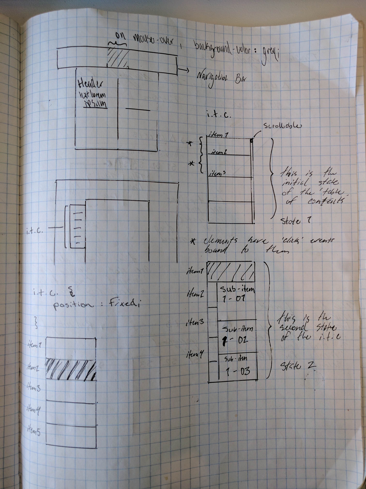
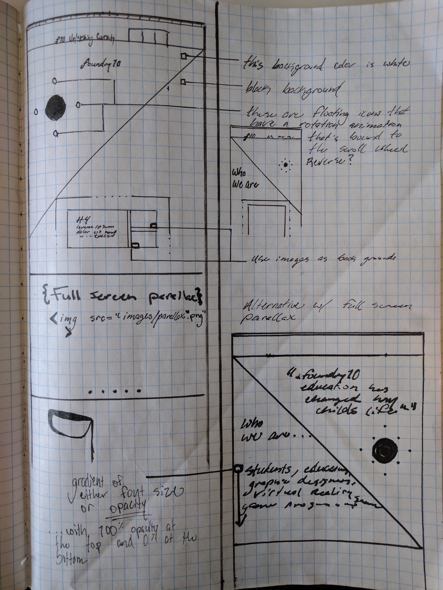
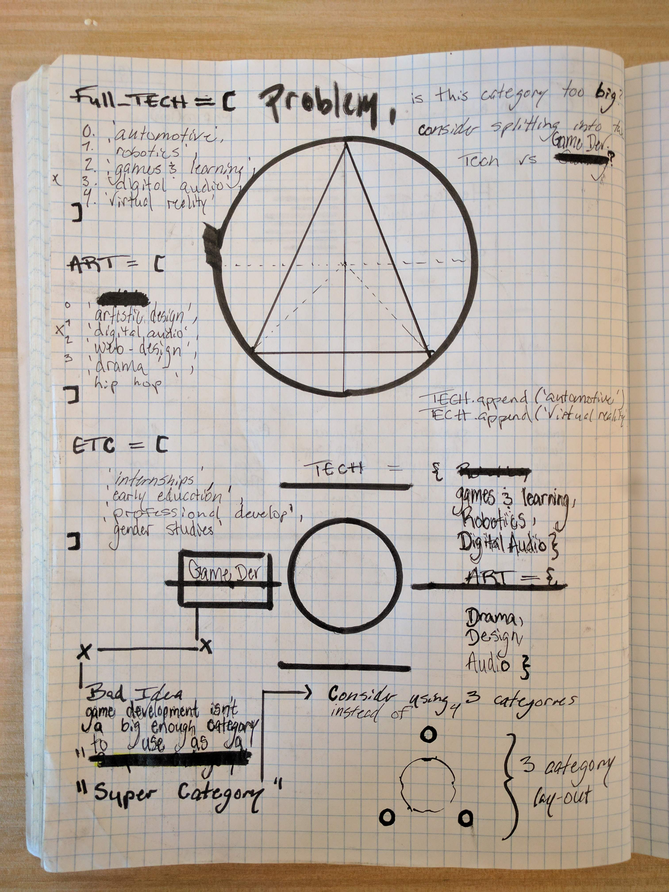

